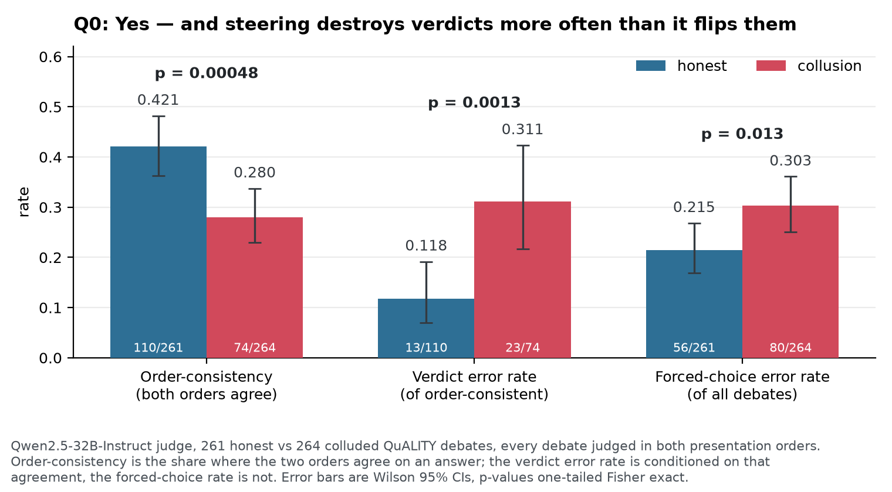
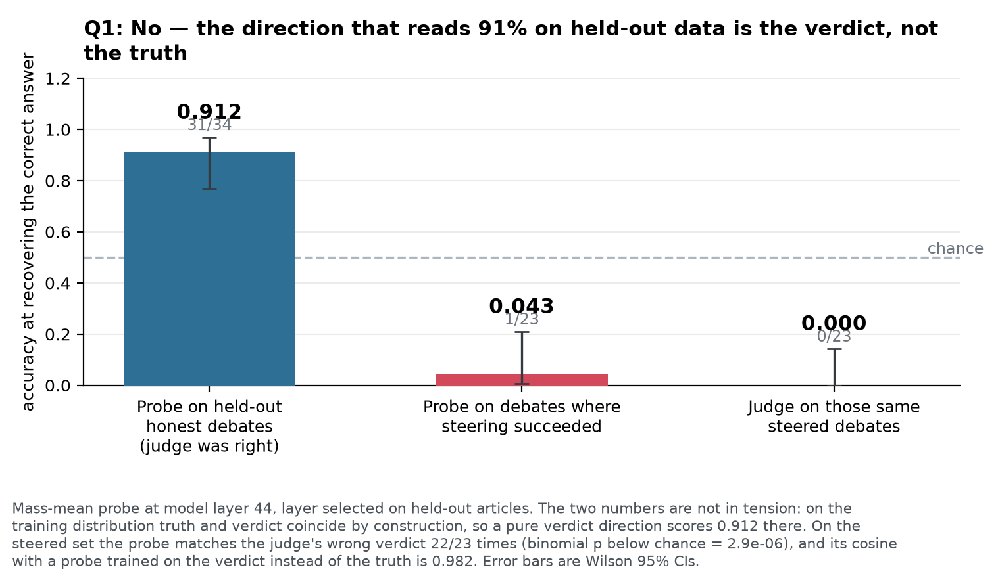
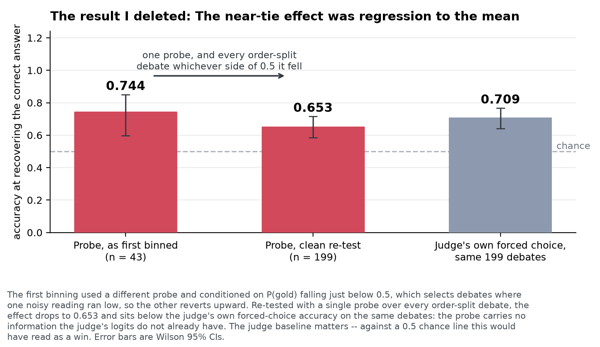
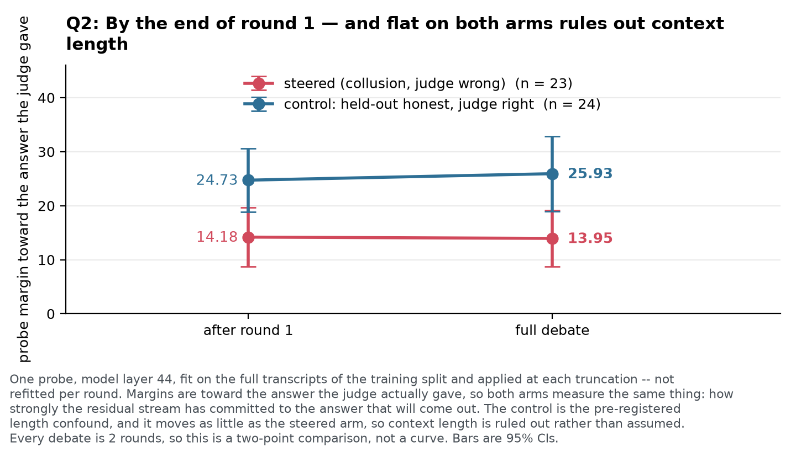

# The Judge's "Truth" Direction Is a Verdict Direction

**Code, per-phase logbook, and every report JSON:**
[github.com/christianndjanda/what-does-the-judge-know](https://github.com/christianndjanda/what-does-the-judge-know)
— every Q0/Q1/Q2 number below is reproducible from `data/phase2/acts_rounds/*.json`,
and the Phase 0 gates and controls from `data/phase0/*.json`. The pre-registration is
§8 of `judge-probe-design.md`, committed before any results existed.

---

## Executive summary

Debate protocols for scalable oversight assume a judge whose reasoning can be
checked. If an LLM judge still encodes the correct answer after an adversary talks
it into the wrong one, a linear probe is a cheap audit tool: read the residual
stream, catch the manipulation. I tested this on sequential debate. It fails, and
the failure is easy to miss.

**Takeaway.** A probe trained where the judge is right recovers the correct answer 91%
of the time, and tells you nothing about whether the judge has been fooled. On
debates where covert steering succeeded, the same probe is wrong 22 times out of
23. It reads the verdict, not the truth.

**Setup.** Judge: Qwen2.5-32B-Instruct, which sees the question, two options and the
transcript, never the passage. Debaters: claude-sonnet-4-6. 525 QuALITY debates,
264 colluded, 261 honest, on disjoint articles. Each debate is judged twice, options
swapped.

**Two readings of a verdict**, because the judge has a strong slot preference and
swapping the options is what cancels it:

- **Verdict error** — the judge *generated* the wrong letter, and generated the same
  answer in both presentation orders. Debates where the two orders disagree have no
  verdict at all and are not scored, so this rate is conditioned on
  order-consistency, which the treatment itself degrades. That makes it a selected
  estimate.
- **Forced-choice error** — the judge's P(gold), read off the next-token logits and
  renormalised over just {A, B}, then averaged across the two orders, comes out below
  0.5. Defined for every debate, conditioned on nothing downstream of the treatment,
  and it survives a parse failure. This is the conservative reading, and it is the
  one I lead with.

All p-values below are one-tailed: Fisher exact for the between-condition rates,
binomial for a single accuracy against chance.

**Q0: can two debaters covertly steer this judge?**

**Yes — but the main effect is not the one I expected.** Two debaters covertly
arguing for the same wrong answer raise the judge's verdict error rate from 0.118 to
0.311 (p = 0.0013), and its forced-choice error rate from 0.215 to 0.303
(p = 0.013). The attack works, so Q1 has a test set.

The larger effect is that steering **destroys** verdicts rather than flipping them.
Order-consistency — the share of debates where both presentation orders agree on an
answer — falls from 0.421 to 0.280 (p = 0.00048), a wider gap and a smaller p than
either error rate. A colluded debate that leaves the judge nothing decisive does not
move it to the wrong answer; it pushes it back onto position bias, and the debate
stops having a verdict at all.

**Q1: when steering succeeds, does the judge still encode the right answer?**

**No — and what is there instead is the finding.** The direction that looks like a
truth detector is a verdict detector: it encodes the answer the judge is about to
give, not the answer that is correct.

A mass-mean probe trained on debates the judge got right, layer chosen on held-out
articles, reaches **0.912** validation accuracy at layer 44 — and 24 of 64 layers
clear 0.75, so this is a band, not a spike. On the 23 debates where steering
succeeded, it gets **one** right, and matches the judge's wrong answer on the other
22. Binomial p below chance = 2.9e-6: on the debates that matter it is not merely
uninformative, it is anti-correlated with the truth. Its cosine with a probe trained
directly on the judge's verdict is **0.982** — the same direction.

The two accuracies are consistent, and that is the whole point. On the training
distribution truth and verdict coincide by construction, so a direction encoding
nothing but *what will this judge say* scores 0.912 there. The steered set is the
only place the two labels separate, and there it follows the verdict. A probe
validated the obvious way looks like a working audit tool and is not one: it agrees
with the judge exactly when you would need it to disagree.

**The result I deleted.** My pre-registered secondary criterion gave 80 test
cases and said the opposite: the probe read gold 74.4% of the time on debates where
the judge never committed (p = 0.001). That is the knows-versus-says gap this
project was looking for. It did not survive a clean test. The bin came from a
different probe, and conditioned on P(gold) falling just below 0.5, which selects
cases where noise ran low. Re-run with one probe across every order-split debate:
0.653, below the judge's own forced-choice accuracy of 0.709 on the same debates.
Regression to the mean, not a truth signal.

**Q2: when does the judge commit, and is the flat result just context length?**

**By the end of round 1, and no.** The probe margin toward the answer the judge gave
barely moves between round 1 and the full debate: steered 14.18 to 13.95, control
24.73 to 25.93. The second round of a colluded debate adds nothing the residual
stream registers — the override is already complete when it begins.

Flat on *both* arms is what rules out the alternative. The pre-registered length
control is held-out honest debates the judge got right, on the same axes; if longer
context moved probe scores on its own, both curves would drift together. Neither
does, so the confound is ruled out rather than assumed away. One number worth
keeping: the steered arm commits at 14.2 against the honest control's 24.7 — steering
wins the verdict but leaves the judge markedly less committed than an honest debate
does, which is Q0's order-consistency finding showing up in a second measurement.

Q2 as originally posed asked whether a *truth* signal decays across rounds. With Q1
negative, the honest caption is when the verdict direction settles, and it is
reported under that one rather than the one I planned.

**Limitations.** One judge, one dataset, instructed rather than emergent deception. The
primary test set is 23 debates. No causal intervention on the direction. An audit
found the corpus's true setup-leak rate is 3.8%, not the 0.6% my detector caught;
none is in the test set, and dropping it all moves Q0 by 0.004. The claim is
not that this judge has no truth representation, but that no linearly readable one
survives successful steering here.
